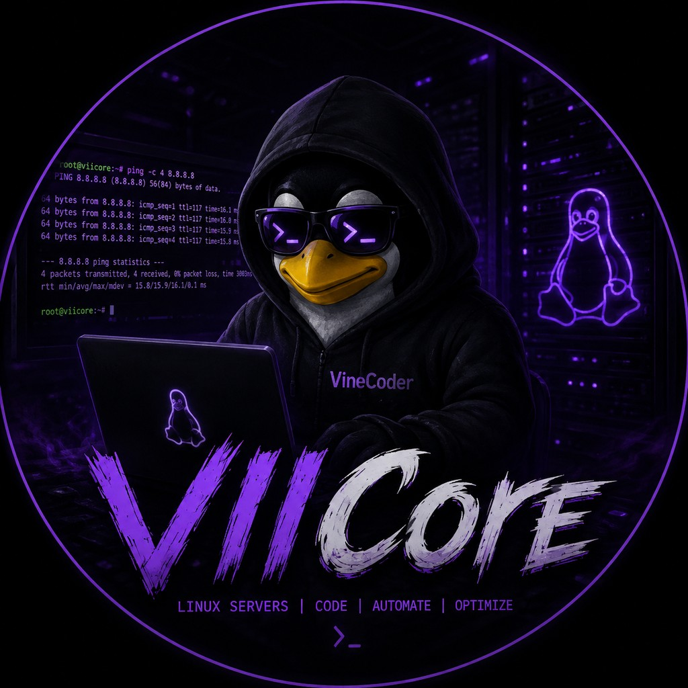

# Hey, I'm VIICore 👋

---

## 🧑‍💻 About me

- 🔭 **Currently working on** — [VIICoreFT](https://github.com/VIICore/VIICoreFT) file transfer tool and [Ping-PlusPlus](https://github.com/VIICore/Ping-PlusPlus) network toolkit
- 🌱 **Learning** — Go, networking, web technologies
- 💻 **Interested in** — automation, CLI tools, web interfaces, system administration
- ⚡ **Fun fact** — I build tools that save time, then use them to build more tools

---

## 🛠️ Tech stack

### 💻 Languages

### 🧰 Tools & platforms

### 🔌 APIs & services

---

## 📊 GitHub stats

  
  

  

---

## 📦 Projects

| Project | Description | Stack |
|---------|-------------|-------|
| [VIICoreFT](https://github.com/VIICore/VIICoreFT) | VIICoreFileTransfer — fast file & folder transfer between your PC and server: parallel chunked uploads, resume, IP filter, one-click HTTPS | Go |
| [Ping-PlusPlus](https://github.com/VIICore/Ping-PlusPlus) | Ping++ — cross-platform network toolkit: ping with geo/stats, multi-ping, subnet scan, traceroute, port checks, subdomain finder, IP lookup, Wi-Fi/LAN scanner | PowerShell |

---

## 📫 Connect with me

---

*Thanks for stopping by! ⭐*

